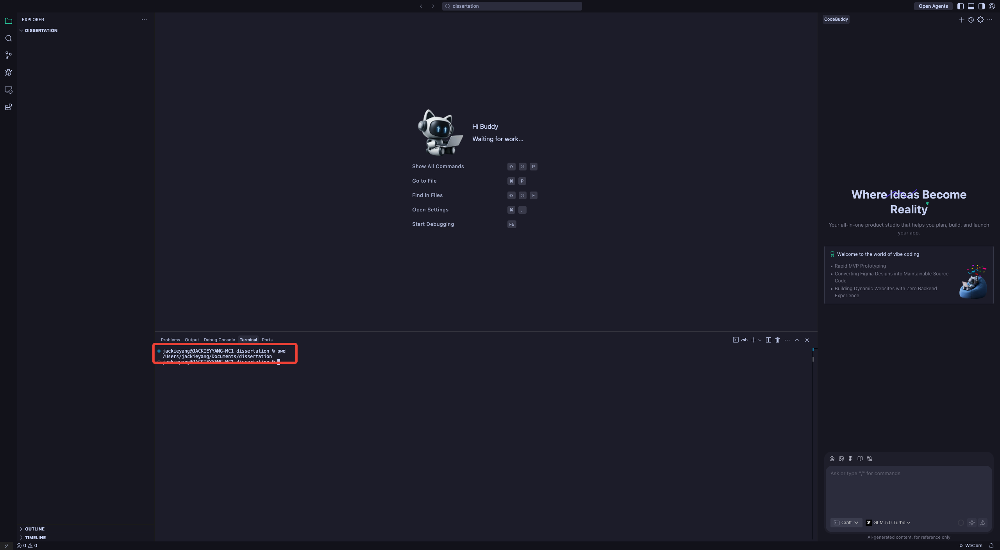
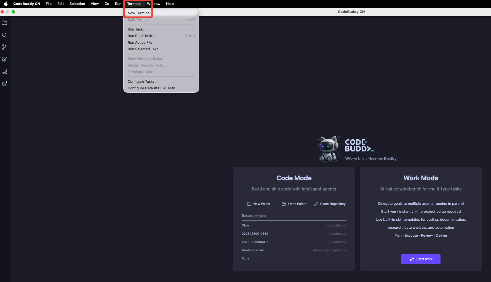
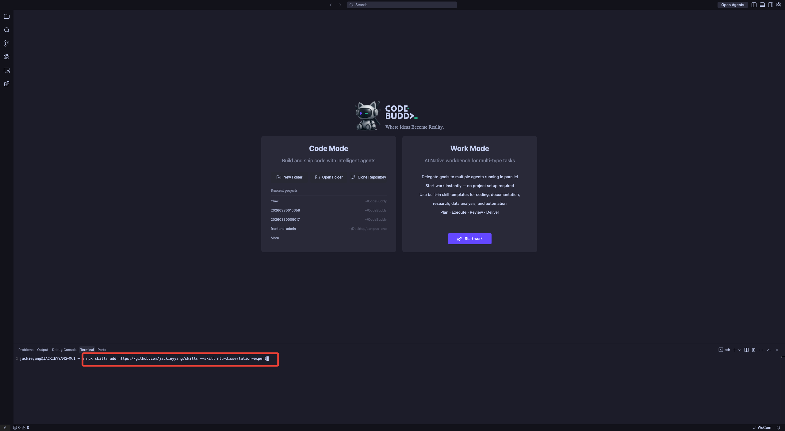
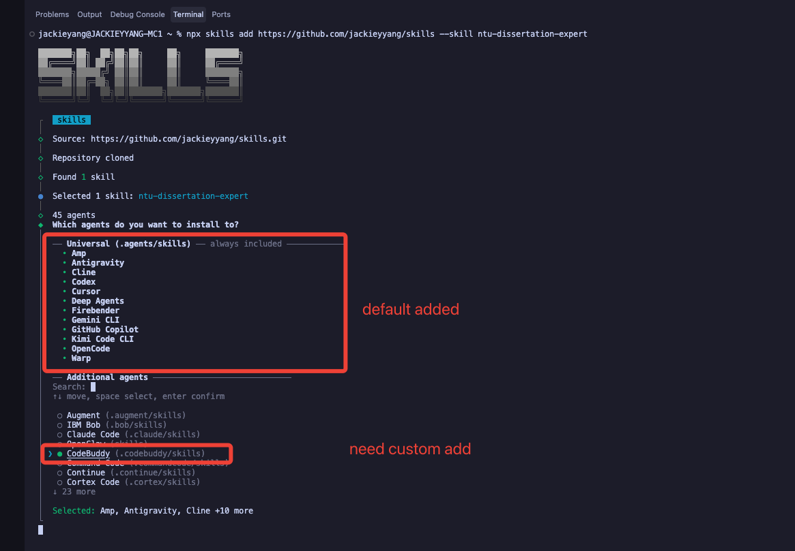
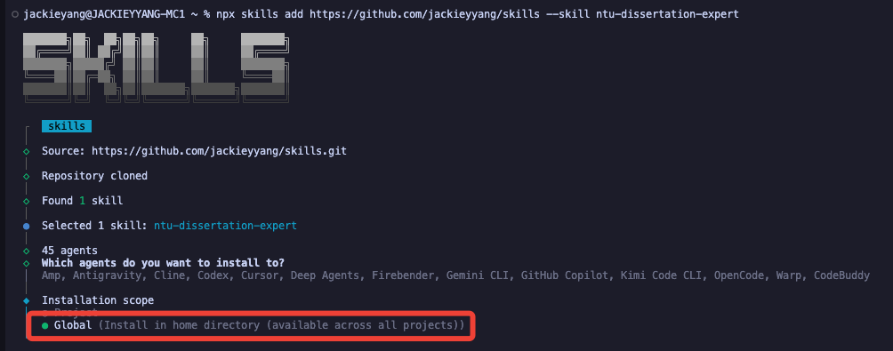
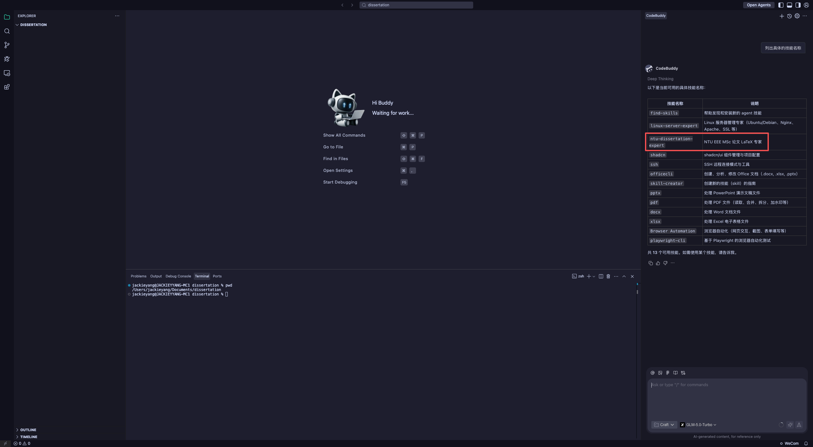
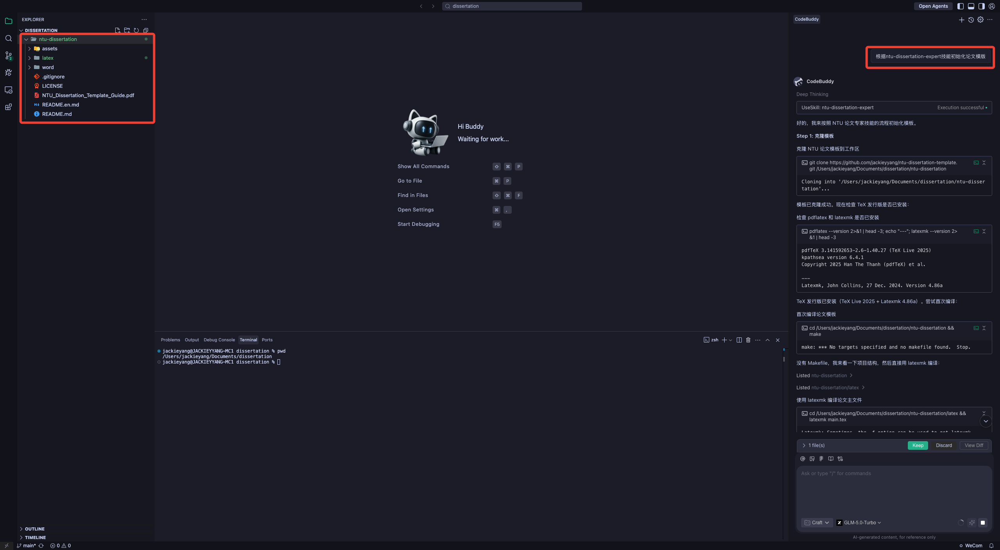
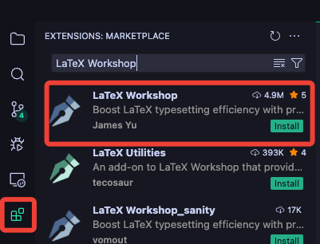
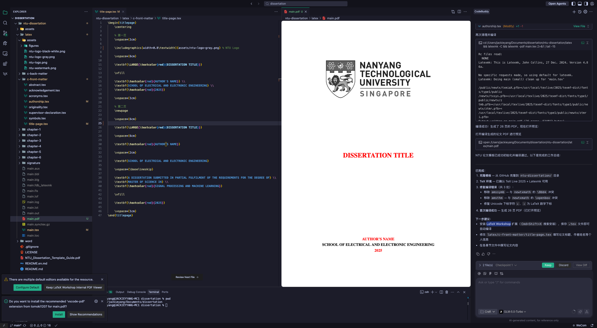

# NTU Dissertation Template - Agent is all you need

<p align="center">
  
</p>

<p align="center">
  <a href="https://github.com/jackieyyang/ntu-dissertation-template/blob/main/LICENSE"></a>
  <a href="https://github.com/jackieyyang/ntu-dissertation-template/stargazers"></a>
  <a href="https://github.com/jackieyyang/ntu-dissertation-template/network/members"></a>
  <a href="https://github.com/jackieyyang/ntu-dissertation-template/issues"></a>
</p>

<p align="center">
  English | <a href="./README.md">中文</a>
</p>

**NTU Dissertation Template** provides both `Word` and `LaTeX` templates for the NTU EEE MSc dissertation, aligned as closely as possible to the official requirements so you can start writing, formatting, and submitting faster.

**If this template helps you, consider giving the repository a Star 🌟**.

## Features

- Dual-template support for `Word` and `LaTeX`
- Covers title page, declarations, abstract, chapters, references, and appendices
- Built-in table of contents, figure/table numbering, cross-references, and bibliography structure
- Preview screenshots and usage notes for a quick start
- Works with AI agents and AI editors through `skills` for drafting, polishing, and structuring

## Official Resources

- Official dissertation resources: [EEE Dissertation Share Documents](https://entuedu.sharepoint.com/sites/Student/cs/eee/Shared%20Documents/Forms/AllItems.aspx?id=%2Fsites%2FStudent%2Fcs%2Feee%2FShared%20Documents%2FGraduate%2FM%2ESc%2E%20Programme%2FMaster%20of%20Science%20%28MSc%29%20Programme%2FImportant%20Links%2FDissertation)
- Official dissertation template guidance: [EEE Dissertation Template](https://entuedu.sharepoint.com/sites/Student/cs/eee/Shared%20Documents/Forms/AllItems.aspx?id=%2Fsites%2FStudent%2Fcs%2Feee%2FShared%20Documents%2FGraduate%2FM%2ESc%2E%20Programme%2FMaster%20of%20Science%20%28MSc%29%20Programme%2FImportant%20Links%2FDissertation%2FGuideline-MSc-Diss_v8%2Epdf&parent=%2Fsites%2FStudent%2Fcs%2Feee%2FShared%20Documents%2FGraduate%2FM%2ESc%2E%20Programme%2FMaster%20of%20Science%20%28MSc%29%20Programme%2FImportant%20Links%2FDissertation)
- Official submission flow: [EEE Dissertation Process Flow](https://entuedu.sharepoint.com/sites/Student/cs/eee/Shared%20Documents/Forms/AllItems.aspx?id=%2Fsites%2FStudent%2Fcs%2Feee%2FShared%20Documents%2FGraduate%2FM%2ESc%2E%20Programme%2FMaster%20of%20Science%20%28MSc%29%20Programme%2FImportant%20Links%2FDissertation%2FMSc%20Dissertation%20Process%20Flow_updated%2Epdf&parent=%2Fsites%2FStudent%2Fcs%2Feee%2FShared%20Documents%2FGraduate%2FM%2ESc%2E%20Programme%2FMaster%20of%20Science%20%28MSc%29%20Programme%2FImportant%20Links%2FDissertation)


## Preview


## Quick Start

You can refer to either of the following approaches. If you prefer a traditional writing workflow, we recommend Option 2. If you are comfortable using this template through natural language conversation, we recommend Option 1.

### Option 1: Agent is all you need

If you want to use the dissertation template through conversation, use `skills` with any Agent / AI editor you like (e.g. Cursor, CodeBuddy).

If you prefer **zero local environment setup**, you can use [OpenAI Prism](https://openai.com/prism) directly.

1. Download an AI editor
    - Cursor: [Download Cursor](https://cursor.com/download)
    - CodeBuddy: [Download CodeBuddy](https://www.codebuddy.cn/ide/?auto-download=1)
    - Trae: [Download Trae](https://www.trae.ai/download)

2. Create a folder for your dissertation and open it in the editor

    

3. Open a terminal and install `skills`. Walkthrough in the terminal for installing `skills` (in order):

    ```bash
    npx skills add https://github.com/jackieyyang/skills --skill ntu-dissertation-expert
    ```

    
    
    
    

4. In the chat panel on the right, confirm that the installation succeeded

    

5. In the chat panel on the right, use natural language so the agent can pull the template, compile, and apply edits

    

6. Install **LaTeX Workshop** from the Extensions marketplace to get save-and-auto-compile

    

7. Final result—start natural language interaction

    

### Option 2: Traditional templates (Word / LaTeX)

If you prefer to write and edit by hand, use the `Word` or `LaTeX` template directly.

#### Word

- Template download: [Download Word template](https://github.com/jackieyyang/ntu-dissertation-template/raw/refs/heads/main/word/Dissertation%20Template.docx)
- Open in Microsoft Word or WPS Office and start editing
- Replace placeholders for title, name, school, year, etc.
- Right-click the table of contents and choose **Update Field**, or press F9 to refresh the TOC, figures, and references
- Detailed guide: [Download Word template guide (PDF)](https://github.com/jackieyyang/ntu-dissertation-template/raw/refs/heads/main/NTU_Dissertation_Template_Guide.pdf)

#### LaTeX

- Template download: [Download LaTeX template (ZIP)](https://github.com/jackieyyang/ntu-dissertation-template/archive/refs/heads/main.zip)
- Import into Overleaf or compile locally
- GitHub does not provide a ZIP of only the `latex` folder; extract and use the `latex` directory from the archive

## Update Notes

- `2026-03-30`: Fixed incorrect equation numbering so chapter equation indices display correctly.
- `2025-04-14`: Added a gray NTU logo asset for cover and page styling.
- `2025-04-10`: Fixed a hidden layout issue when page numbers exceeded two digits.
- `2025-02-19`: Added `BibTeX` examples, appendix structure, and more sample content for the writing workflow.
- `2025-02-16`: Released the LaTeX template with front matter, chapters, appendices, assets, and README updates for a Word / LaTeX dual setup.

## Star History

[](https://www.star-history.com/#jackieyyang/ntu-dissertation-template&type=date&legend=top-left)

## License

[MIT](./LICENSE)
