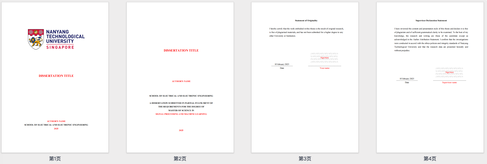
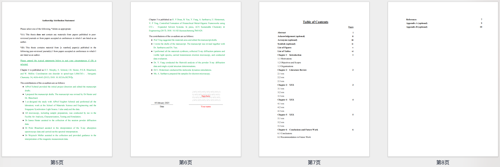
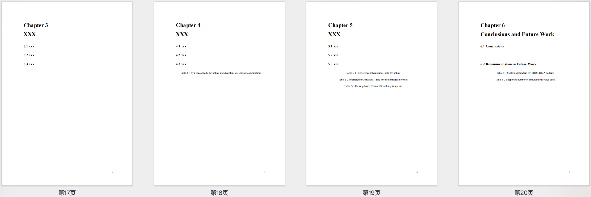

# 🎓 NTU Dissertation Template 📄

> **A dissertation template for NTU EEE students (Word / LaTeX)**  
> **Fully aligned with the official template, beautifully formatted and easy to use**  
> **Completely open-source and free to use, helping you focus on research while effortlessly formatting your thesis!**  

For the latest official template, refer to: [Latest Official Template](https://entuedu.sharepoint.com/sites/Student/cs/eee/Shared%20Documents/Forms/AllItems.aspx?id=%2Fsites%2FStudent%2Fcs%2Feee%2FShared%20Documents%2FGraduate%2FM%2ESc%2E%20Programme%2FMaster%20of%20Science%20%28MSc%29%20Programme%2FImportant%20Links%2FDissertation%2FGuideline%2DMSc%2DDiss%5Fv8%2Epdf&parent=%2Fsites%2FStudent%2Fcs%2Feee%2FShared%20Documents%2FGraduate%2FM%2ESc%2E%20Programme%2FMaster%20of%20Science%20%28MSc%29%20Programme%2FImportant%20Links%2FDissertation)

English | [中文](./README.md) 

## 🚀 Features

✅ **Complies with NTU postgraduate dissertation format** 📄  
✅ **Automatically generates Table of Contents & List of Figures/Tables** 📜  
✅ **Captions & Cross-referencing with auto-numbering support** 📖  
✅ **One-click update (`F9`) for Table of Contents, Figures & References** 🔄  
✅ **Professional formatting, reducing time spent on adjustments** 🎯 

## 📥 Download & Usage

### **1️⃣ Download**

Click [**Download Now**](https://github.com/jackieyyang/ntu-dissertation-template/archive/refs/heads/main.zip).

## 📄 Word Version Guide

### **2️⃣ Open & Customize**

- Open `Dissertation_Template.docx` using **WPS Office**.  
- Replace **title, name, school, year, etc.**, and change text color to black.  
- **Keep the format intact** while adding your dissertation content.  

### **3️⃣ Update Table of Contents & Figure Numbers**

- Right-click **Table of Contents → Select "Update Field" → "Update Entire Table"**.  
- Select **Figures or Tables** → Press **`F9`** to refresh numbering automatically.  

### **4️⃣ Export to PDF & Submit**

- **File → Export → Save as PDF**.  
- Ensure the format complies with NTU dissertation submission requirements.  

---

## 🖋 LaTeX Version Guide

### **1️⃣ Download the LaTeX Template**

Go to the GitHub repository and download the `https://github.com/jackieyyang/ntu-dissertation-template/latex` directory or clone the entire project.

### **2️⃣ Main File Structure**

```
latex/
│── assets/                         % Resource folder
│   ├── figures/                    % Stores images
│   │   └── ntu-logo.png
│   └────── ntu-watermark.png
│── c-front-matter/                 % Front matter
│   ├── title-page.tex              % Title page
│   ├── abstract.tex                % Abstract
│   ├── acknowledgement.tex         % Acknowledgements
│   ├── acronyms.tex                % Acronyms
│   ├── authorship.tex              % Authorship declaration
│   ├── originality.tex             % Originality statement
│   ├── supervisor-declaration.tex  % Supervisor declaration
│   └── symbols.tex                 % List of symbols
│── chapters/                       % Chapters
│   ├── chapter-1.tex
│   ├── chapter-2.tex
│   ├── chapter-3.tex
│   ├── chapter-4.tex
│   ├── chapter-5.tex
│   └── chapter-6.tex
│── back-matter/           % Back matter
│   ├── references.tex     % References
│   ├── appendix-a.tex     % Appendix A
│   └── appendix-b.tex     % Appendix B
│── signature/             % Signature section (if required for submission)
└── main.tex               % Main file containing all chapters
```

### **3️⃣ Compilation Method**

Recommended to use **Overleaf** for compilation.

### **4️⃣ LaTeX Template Features**

✅ **Automatically generates Table of Contents & List of Figures/Tables**  
✅ **Auto-numbering for equations, figures & cross-referencing**  
✅ **Supports BibTeX reference management**  
✅ **Complies with NTU EEE dissertation format**  

### **5️⃣ Exporting PDF from LaTeX**

After compiling on Overleaf or locally, generate `main.pdf` and ensure it meets NTU dissertation submission requirements.

## 🖼 Preview (Template Screenshots)

Here are examples of the **NTU Dissertation Template**:

  
  
  
  
  
  

## 📖 Detailed Documentation

For the full **User Guide**, refer to `NTU_Dissertation_Template_Guide.pdf` for step-by-step instructions.

## 📝 License

This template is released under the **MIT License** and is fully open-source.  
You are free to use, modify, and share it, but **please retain the original copyright information** to support wider adoption.

🎉 **If this template helps you, consider giving it a ⭐Star!**  

Let's make this free dissertation template available to more NTU postgraduate students! 🚀