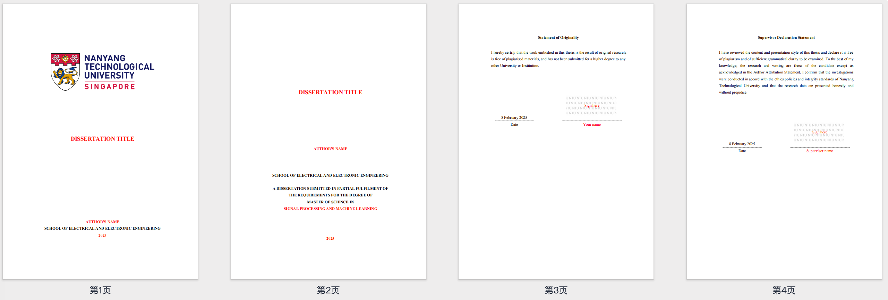
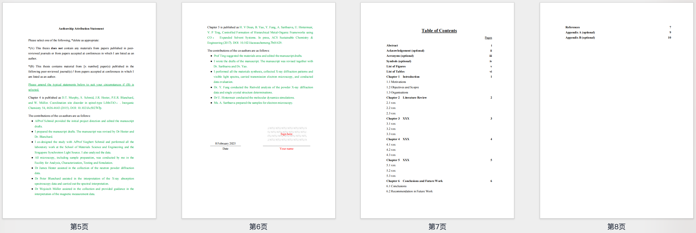
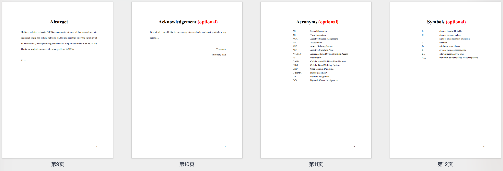
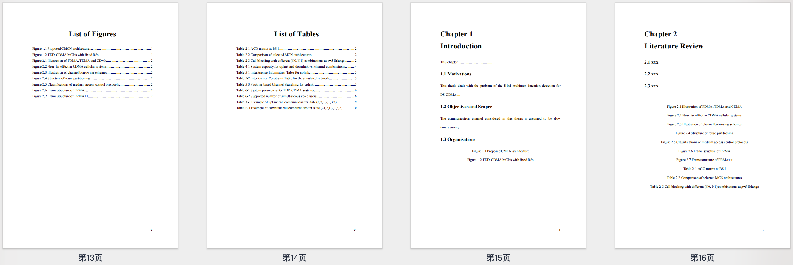
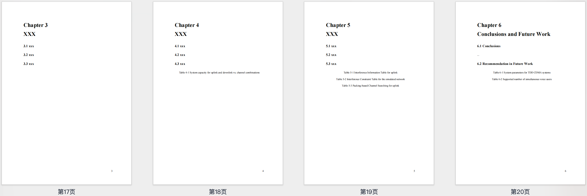
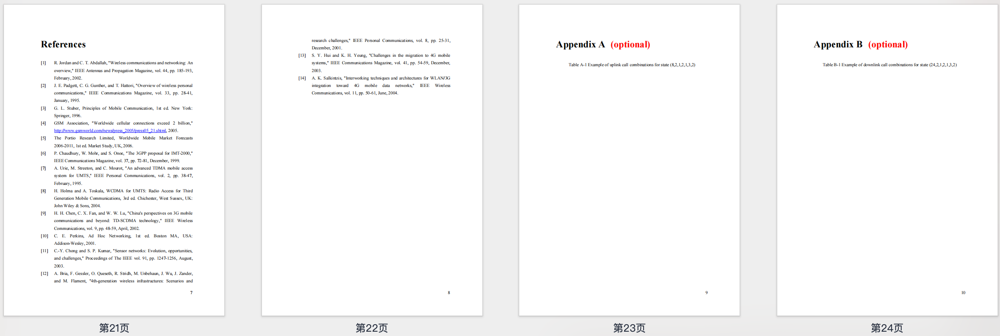

# NTU 论文模板 (Dissertation Template)

> **多格式支持**：Word / LaTeX 双模板支持 <br>
> **完全一致**：100% 还原官方模板，精美好用，拒绝市面粗制滥造 <br>
> **免费使用**：完全开源，MIT 协议按需二次修改 <br>

官方论文相关文档：[EEE Dissertation Share Documents](https://entuedu.sharepoint.com/sites/Student/cs/eee/Shared%20Documents/Forms/AllItems.aspx?id=%2Fsites%2FStudent%2Fcs%2Feee%2FShared%20Documents%2FGraduate%2FM%2ESc%2E%20Programme%2FMaster%20of%20Science%20%28MSc%29%20Programme%2FImportant%20Links%2FDissertation).

官方论文模板：[EEE Dissertation Template](https://entuedu.sharepoint.com/sites/Student/cs/eee/Shared%20Documents/Forms/AllItems.aspx?id=%2Fsites%2FStudent%2Fcs%2Feee%2FShared%20Documents%2FGraduate%2FM%2ESc%2E%20Programme%2FMaster%20of%20Science%20%28MSc%29%20Programme%2FImportant%20Links%2FDissertation%2FGuideline-MSc-Diss_v8%2Epdf&parent=%2Fsites%2FStudent%2Fcs%2Feee%2FShared%20Documents%2FGraduate%2FM%2ESc%2E%20Programme%2FMaster%20of%20Science%20%28MSc%29%20Programme%2FImportant%20Links%2FDissertation).

官方提交流程图：[EEE Dissertation Process Flow](https://entuedu.sharepoint.com/sites/Student/cs/eee/Shared%20Documents/Forms/AllItems.aspx?id=%2Fsites%2FStudent%2Fcs%2Feee%2FShared%20Documents%2FGraduate%2FM%2ESc%2E%20Programme%2FMaster%20of%20Science%20%28MSc%29%20Programme%2FImportant%20Links%2FDissertation%2FMSc%20Dissertation%20Process%20Flow_updated%2Epdf&parent=%2Fsites%2FStudent%2Fcs%2Feee%2FShared%20Documents%2FGraduate%2FM%2ESc%2E%20Programme%2FMaster%20of%20Science%20%28MSc%29%20Programme%2FImportant%20Links%2FDissertation).

[English](./README.en.md) | 中文

## 功能特点

- 符合 NTU 研究生论文格式
- 自动生成目录 & 图表目录
- 题注 & 交叉引用，支持自动编号
- 一键更新（`F9`）目录、图表 & 参考文献
- 专业排版，减少格式调整时间


## 下载 & 使用

### 下载

点击 [**一键下载**](https://github.com/jackieyyang/ntu-dissertation-template/archive/refs/heads/main.zip)。


## Word 版使用指南

### 打开并自定义

- 使用 WPS Office 打开 `Dissertation_Template.docx`。
- 替换标题、姓名、学院、年份等信息，将其转为黑色。
- 保持格式完整，并添加你的论文内容。

### 更新目录 & 图表编号

- 右键 目录 → 选择“更新字段” → “更新整个目录”。
- 选中 图表或表格 → 按 `F9` 进行自动编号更新。

### 导出 PDF 并提交

- 文件 → 导出 → 另存为 PDF。
- 确保格式符合 NTU 论文提交要求。


## LaTeX 版使用指南

### 下载 LaTeX 版模板

进入 GitHub 仓库，下载 `https://github.com/jackieyyang/ntu-dissertation-template/latex` 目录，或克隆完整项目。

### 主要文件结构

```
latex/
│── assets/                         % 资源文件夹
│   ├── figures/                    % 存放图片
│   │   └── ntu-logo.png
│   └────── ntu-watermark.png
│── c-front-matter/                 % 前置部分
│   ├── title-page.tex              % 标题页
│   ├── abstract.tex                % 摘要
│   ├── acknowledgement.tex         % 致谢
│   ├── acronyms.tex                % 缩写页
│   ├── authorship.tex              % 作者关系
│   ├── originality.tex             % 原创声明
│   ├── supervisor-declaration.tex  % 导师声明
│   └── symbols.tex                 % 符号页
│── chapters/                       % 章节内容
│   ├── chapter-1.tex
│   ├── chapter-2.tex
│   ├── chapter-3.tex
│   ├── chapter-4.tex
│   ├── chapter-5.tex
│   └── chapter-6.tex
│── c-back-matter/                   % 结尾部分
│   ├── references.tex               % 参考文献
│   ├── references.bib               % bib格式参考文献
│   ├── appendix-a.tex               % 附录 A
│   └── appendix-b.tex               % 附录 B
│── signature/                       % 签名部分（如需提交认证）
└── main.tex                         % 主文件，包含所有章节
```

### 编译方式

推荐使用 Overleaf 进行编译。

### LaTeX 版论文格式特性

自动生成目录 & 图表目录* 
自动编号公式、图表 & 交叉引用
支持 BibTeX 参考文献管理
符合 NTU EEE 论文格式要求 

### LaTeX 版导出 PDF

在 Overleaf 或本地编译后，生成 `main.pdf`，确保符合 NTU 论文提交要求。

## 预览（模板截图）

以下是 NTU 论文模板的示例：








## 详细文档

完整的使用指南请参考 `NTU_Dissertation_Template_Guide.pdf` 了解详细操作步骤。


## 许可证（License）

本模板采用 MIT 许可证，完全开源免费。  
你可以自由使用、修改和分享，但请保留原始版权信息，以支持更多人受益。


**如果本模板对你有帮助，请记得点亮 ⭐Star！**

让更多 NTU 研究生能够免费使用这款论文模板！
