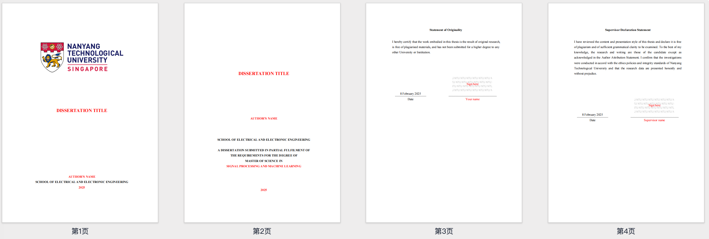
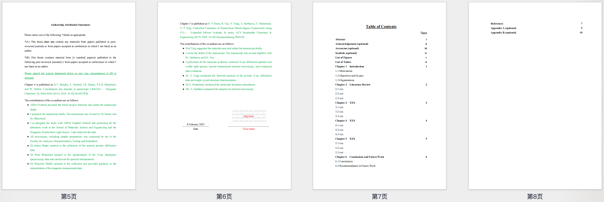
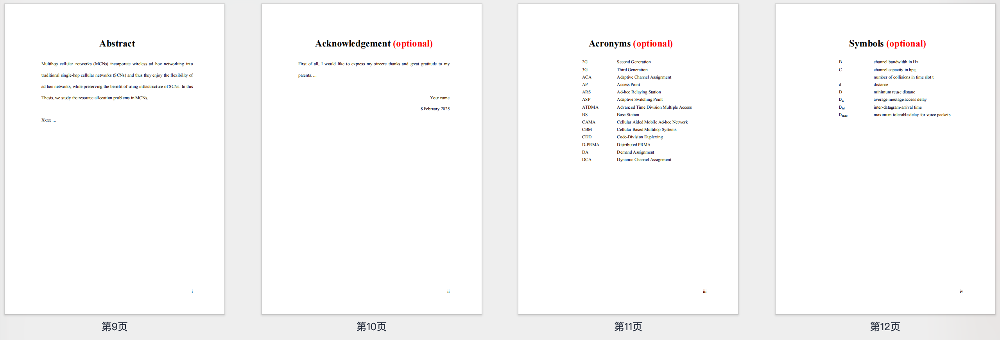
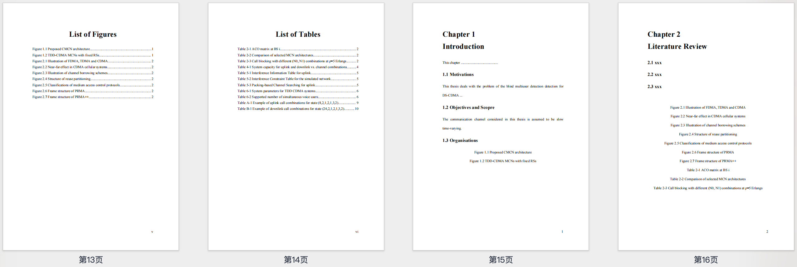
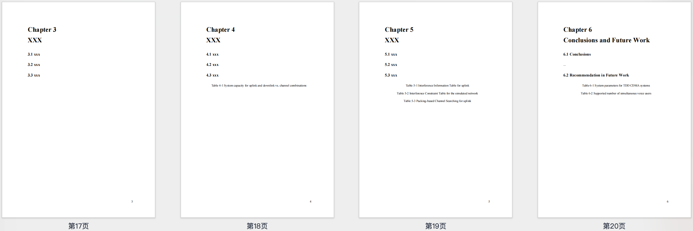
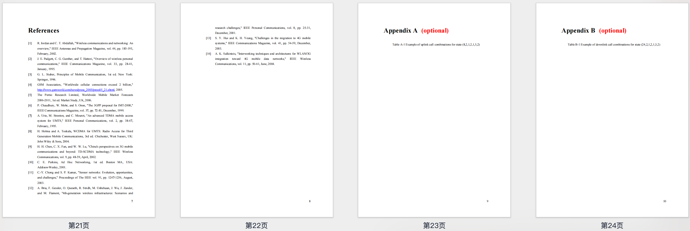

# NTU 论文模板

<p align="center">
  
</p>

<p align="center">
  <a href="https://github.com/jackieyyang/ntu-dissertation-template/blob/main/LICENSE"></a>
  <a href="https://github.com/jackieyyang/ntu-dissertation-template/stargazers"></a>
  <a href="https://github.com/jackieyyang/ntu-dissertation-template/network/members"></a>
  <a href="https://github.com/jackieyyang/ntu-dissertation-template/issues"></a>
</p>


<p align="center">
  <a href="./README.en.md">English</a> | 中文
</p>


**NTU 论文模板** 提供适用于 NTU EEE MSc Dissertation 的 `Word` 与 `LaTeX` 双模板，尽量贴合官方格式要求，帮助你更快开始写作、排版和提交论文。

**如果这个模板对你有帮助，欢迎点一个 Star 🌟**。

## 特点

- `Word` 与 `LaTeX` 双版本模板
- 覆盖标题页、声明页、摘要、正文、参考文献与附录
- 内置目录、图表编号、交叉引用与参考文献结构
- 附带模板截图与使用说明，便于快速上手
- 支持结合 AI Agent / AI Editor，通过 `skills` 辅助论文写作、润色与结构整理

## 官方资源

- 官方论文资料：[EEE Dissertation Share Documents](https://entuedu.sharepoint.com/sites/Student/cs/eee/Shared%20Documents/Forms/AllItems.aspx?id=%2Fsites%2FStudent%2Fcs%2Feee%2FShared%20Documents%2FGraduate%2FM%2ESc%2E%20Programme%2FMaster%20of%20Science%20%28MSc%29%20Programme%2FImportant%20Links%2FDissertation)
- 官方论文模板说明：[EEE Dissertation Template](https://entuedu.sharepoint.com/sites/Student/cs/eee/Shared%20Documents/Forms/AllItems.aspx?id=%2Fsites%2FStudent%2Fcs%2Feee%2FShared%20Documents%2FGraduate%2FM%2ESc%2E%20Programme%2FMaster%20of%20Science%20%28MSc%29%20Programme%2FImportant%20Links%2FDissertation%2FGuideline-MSc-Diss_v8%2Epdf&parent=%2Fsites%2FStudent%2Fcs%2Feee%2FShared%20Documents%2FGraduate%2FM%2ESc%2E%20Programme%2FMaster%20of%20Science%20%28MSc%29%20Programme%2FImportant%20Links%2FDissertation)
- 官方提交流程图：[EEE Dissertation Process Flow](https://entuedu.sharepoint.com/sites/Student/cs/eee/Shared%20Documents/Forms/AllItems.aspx?id=%2Fsites%2FStudent%2Fcs%2Feee%2FShared%20Documents%2FGraduate%2FM%2ESc%2E%20Programme%2FMaster%20of%20Science%20%28MSc%29%20Programme%2FImportant%20Links%2FDissertation%2FMSc%20Dissertation%20Process%20Flow_updated%2Epdf&parent=%2Fsites%2FStudent%2Fcs%2Feee%2FShared%20Documents%2FGraduate%2FM%2ESc%2E%20Programme%2FMaster%20of%20Science%20%28MSc%29%20Programme%2FImportant%20Links%2FDissertation)


## 预览








## 快速开始

您可以参考以下任意一种方式使用本模板，如果您偏好传统写作流程，建议选择方式二，如果您接受通过自然语言对话的方式使用本模板，建议选择方式一。

### 方式一：Agent is all you need

如果你希望通过自然语言对话来完成论文模板使用，推荐使用 `skills` 搭配任意你喜欢的 Agent / AI Editor（如 Cursor、CodeBuddy）。

1. 安装 `Node.js` 环境，确保本机可以使用 `npx` 命令。

2. 安装 `skills`

    ```bash
    npx skills add https://github.com/jackieyyang/skills --skill ntu-dissertation-expert
    ```

3. 下载并打开你喜欢的 AI Editor，如 `Cursor`、`CodeBuddy` 等支持 Agent / AI 对话能力的编辑器。
4. 通过自然语言对话的方式，Agent 会自动完成模版拉取，编译，修改工作。

### 方式二：传统模版使用（Word / LaTeX）

如果你更希望自己手动编写内容，也可以直接使用 `Word` 或 `LaTeX` 模板。

#### Word 版本

- 模板下载：[下载 Word 模板](https://github.com/jackieyyang/ntu-dissertation-template/raw/refs/heads/main/word/Dissertation%20Template.docx)
- 使用 Microsoft Word 或 WPS Office 打开即可开始编辑
- 按需替换标题、姓名、学院、年份等占位内容
- 右键目录选择“更新字段”，或使用 F9 更新目录、图表和引用编号
- 详细说明：[下载 Word 模板说明](https://github.com/jackieyyang/ntu-dissertation-template/raw/refs/heads/main/NTU_Dissertation_Template_Guide.pdf)

#### LaTeX 版本

- 模版下载：[下载 LaTeX 模板](https://github.com/jackieyyang/ntu-dissertation-template/archive/refs/heads/main.zip)
- 可导入 Overleaf，或在本地编译使用
- GitHub 不支持单独下载 `latex` 目录的 ZIP；请只取 `latex` 目录使用

## 更新说明

- `2026-03-30`：修正公式编号显示错误，避免章节中的公式索引展示异常。
- `2025-04-14`：新增灰色 NTU Logo 资源，方便封面与页面视觉风格调整。
- `2025-04-10`：修复页码超过两位数时的隐藏排版问题，提升长论文场景下的稳定性。
- `2025-02-19`：加入 `BibTeX` 参考文献示例、附录结构与部分示例内容，完善学术写作工作流。
- `2025-02-16`：发布 LaTeX 版本模板，补齐前置页、正文、附录、资源文件与 README 说明，形成 Word / LaTeX 双模板结构。

## 关注记录

[](https://www.star-history.com/#jackieyyang/ntu-dissertation-template&type=date&legend=top-left)

## 许可证

[MIT](./LICENSE)
